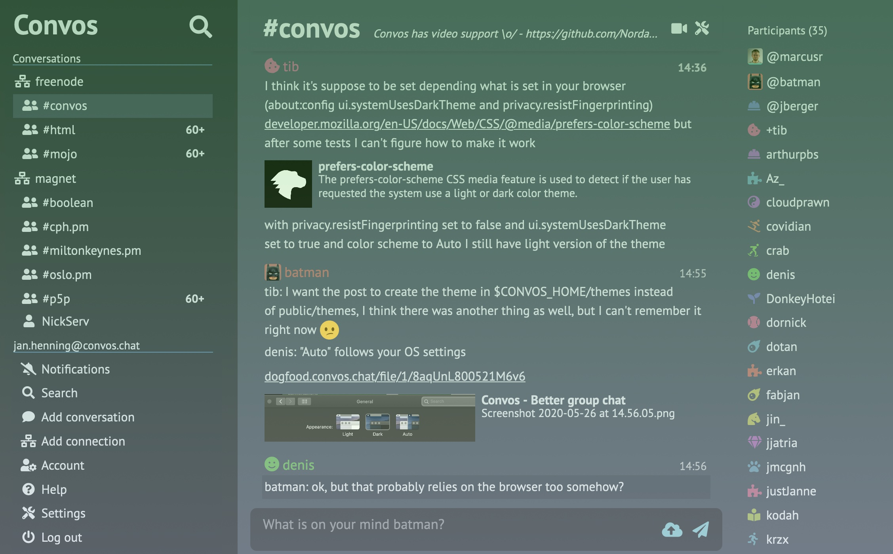

<!--
To README zostało automatycznie wygenerowane przez <https://github.com/YunoHost/apps/tree/master/tools/readme_generator>
Nie powinno być ono edytowane ręcznie.
-->

# Convos dla YunoHost

[](https://ci-apps.yunohost.org/ci/apps/convos/)


[](https://install-app.yunohost.org/?app=convos)

*[Przeczytaj plik README w innym języku.](./ALL_README.md)*

> *Ta aplikacja pozwala na szybką i prostą instalację Convos na serwerze YunoHost.*  
> *Jeżeli nie masz YunoHost zapoznaj się z [poradnikiem](https://yunohost.org/install) instalacji.*

## Przegląd

Convos is an IRC client that runs in your browser and brings the IRC experience into the 21st century.  
It features a persistent bouncer on the server side that will keep you online even after you close your browser window.  
Want to use Convos on your phone? No problem! Convos is fully responsive and fits any screen.


**Dostarczona wersja:** 8.07~ynh1

**Demo:** <https://convos.chat/#instant-demo>

## Zrzuty ekranu



## :red_circle: Niepożądane funkcje

- **Not totally free package**: The YunoHost package of this app is under an overall free license, but with clauses that may restrict its use.

## Dokumentacja i zasoby

- Oficjalna strona aplikacji: <http://convos.chat/>
- Oficjalna dokumentacja dla administratora: <https://convos.chat/doc/>
- Repozytorium z kodem źródłowym: <https://github.com/convos-chat/convos>
- Sklep YunoHost: <https://apps.yunohost.org/app/convos>
- Zgłaszanie błędów: <https://github.com/YunoHost-Apps/convos_ynh/issues>

## Informacje od twórców

Wyślij swój pull request do [gałęzi `testing`](https://github.com/YunoHost-Apps/convos_ynh/tree/testing).

Aby wypróbować gałąź `testing` postępuj zgodnie z instrukcjami:

```bash
sudo yunohost app install https://github.com/YunoHost-Apps/convos_ynh/tree/testing --debug
lub
sudo yunohost app upgrade convos -u https://github.com/YunoHost-Apps/convos_ynh/tree/testing --debug
```

**Więcej informacji o tworzeniu paczek aplikacji:** <https://yunohost.org/packaging_apps>
